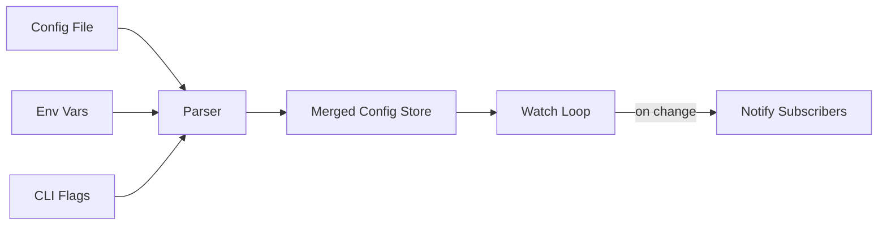

# Anatomy of a Good README

Section-by-section reference for writing GitHub READMEs. Sections are listed in recommended order. Not every project needs every section — guidance on when to include each one is provided.

---

## 1. Project Title and Description

### Purpose
The title and opening lines are the entire pitch. A developer scanning GitHub search results, an awesome-list, or a link from a colleague will read the title and first sentence. If those don't communicate what the project does and why it matters, they leave.

### When to Include
Always. Every README starts here.

### How to Write It Well

- **Title**: Use the actual project name. Do not add taglines, version numbers, or emoji to the H1. Keep it identical to the repo name so search engines and humans can match them.
- **One-liner**: Immediately below the title, write one sentence that answers "What does this do?" in plain language. Avoid jargon unless the target audience requires it.
- **Expanded description**: Follow with 2-4 sentences covering *why* the project exists and *who* it is for. State the problem it solves, not just the technology it uses.

**Formula**: `[Project name] is a [category] that [does X] for [audience]. Unlike [alternative], it [key differentiator].`

### Common Mistakes
- Writing a clever tagline instead of a clear description ("Turbocharge your workflow!" tells the reader nothing).
- Describing implementation ("A Redis-backed pub/sub framework using async/await") without stating the user-facing benefit.
- Burying the description below badges, logos, and decorative elements so the reader must scroll to find it.

### Example

```markdown
# Viper

Viper is a configuration library for Go applications that handles reading
from JSON, TOML, YAML, env variables, and remote config systems. It lets
you set defaults, override with flags, and watch for live config changes
without restarting your app.
```

---

## 2. Badges / Shields

### Purpose
Badges provide at-a-glance project health signals: CI status, test coverage, latest version, license, download count. They answer "Is this actively maintained? Is it stable?"

### When to Include
Include badges when they convey genuinely useful information. Good candidates:

- **CI/build status** — shows the project is tested and passing.
- **Latest version / release** — helps users confirm they have the right version.
- **License** — saves readers from hunting through files.
- **Coverage** — meaningful for libraries where consumers care about reliability.

Skip badges when:
- The project is a personal tool, script, or prototype.
- You're adding badges purely for visual flair (e.g., "Made with Love" badges).
- The badge information is already obvious from context.

### How to Write It Well

- Place badges on a single line directly below the project description, or between the title and description if following common OSS convention.
- Limit to 3-6 badges. A wall of 15 badges is noise, not signal.
- Order them by importance: build status first, then version, then supplementary.
- Use [shields.io](https://shields.io) for consistent styling.
- Link each badge to something useful (CI dashboard, package registry, license file).

### Common Mistakes
- Adding badges for technologies used ("Built with React" badge on a React project — the `package.json` already says that).
- Displaying a failing CI badge and leaving it. A red badge is worse than no badge.
- Using badges as decoration rather than information.

### Example

```markdown
[](https://github.com/user/repo/actions)
[](https://www.npmjs.com/package/my-package)
[](LICENSE)
```

---

## 3. Visual Demo

### Purpose
A screenshot, GIF, or video answers "What does this look like in action?" faster than any paragraph. For CLI tools, UI libraries, or anything with visual output, a demo is the single most persuasive element in the README.

### When to Include
- **Always** for: CLI tools, UI components/frameworks, desktop apps, visual utilities, terminal tools.
- **Usually** for: Web frameworks (show the generated output), DevOps tools (show the dashboard or terminal output).
- **Rarely needed** for: Pure libraries with no visual output (e.g., a math library, a serialization library). In that case, a code example is the demo.

### How to Write It Well

- **Screenshots**: Use PNG or WebP. Show the tool doing its primary job, not a setup screen. Crop to the relevant area — don't show your entire desktop. Use a clean terminal theme with legible font sizes.
- **GIFs**: Keep them under 15 seconds and under 5MB. Show the core workflow. Use tools like `vhs`, `asciinema`, or LICEcap to record. Optimize with `gifsicle`.
- **Video**: Host on YouTube or embed as an HTML5 video via GitHub's support for `.mp4` in READMEs. Keep under 60 seconds for a demo; link to longer tutorials.
- **Placement**: Put the demo immediately after the description / badges, before any text-heavy sections. The reader should see it without scrolling far.
- **Alt text**: Always include descriptive alt text for accessibility.

### Common Mistakes
- Using a 30MB GIF that takes forever to load.
- Showing an outdated UI that no longer matches the current version.
- Recording on a 4K screen so everything is tiny in the embedded image.
- Omitting alt text on images.

### Example

```markdown
<p align="center">
  
</p>
```

---

## 4. Key Features / Highlights

### Purpose
A scannable list of what makes this project worth using. The description says *what* the project is; this section says *what it can do* in specifics.

### When to Include
Include when the project has 3 or more distinct capabilities worth highlighting. Skip for single-purpose tools where the description already covers everything.

### How to Write It Well

- Use a bulleted list, not paragraphs. Each item should be one line.
- Lead each bullet with the **benefit**, not the implementation detail. "Hot-reload config changes without restarting" is better than "Uses fsnotify for file watching."
- Limit to 5-8 items. If you have more, you're listing features, not highlights.
- Bold the key phrase in each bullet for scannability.
- Be specific. "Fast" means nothing. "Parses 1GB of JSON in 200ms" means something.

### Common Mistakes
- Listing every feature — this is not a changelog or feature matrix.
- Using vague language ("Easy to use", "Highly configurable", "Blazingly fast").
- Duplicating what's in the description.

### Example

```markdown
## Features

- **Live config reload** — watches config files and applies changes without restart
- **Multi-source merging** — reads from YAML, JSON, TOML, env vars, and flags with a defined precedence
- **Type-safe access** — `GetInt`, `GetBool`, `GetStringSlice` with sensible zero-value defaults
- **Remote config** — pulls from etcd, Consul, or Firestore out of the box
- **Nested key access** — use dot notation (`app.server.port`) across any config format
```

---

## 5. Quick Start / Getting Started

### Purpose
Get the reader from zero to "it works" in the fewest possible steps. This is the section that converts a curious visitor into an actual user. If they can't get it running quickly, they'll find an alternative.

### When to Include
Always, unless the project is documentation-only or purely conceptual.

### How to Write It Well

- **Minimize steps**. The ideal quick start is 3 steps: install, configure (if needed), run.
- **Use a single code block** that can be copied and pasted directly into a terminal or file. Do not make the reader piece together commands from multiple blocks.
- **State prerequisites** upfront but briefly (e.g., "Requires Node.js 18+"). Don't explain how to install prerequisites — link to their docs.
- **Show the expected output** so the reader can confirm it worked.
- **Use realistic but minimal examples**. Don't use `foo`/`bar` — use something that hints at real usage.

### Common Mistakes
- Combining quick start with exhaustive installation docs. Keep them separate — quick start is the fast path, installation covers edge cases.
- Assuming the reader knows your ecosystem's tooling.
- Not testing the quick-start steps on a clean environment.
- Requiring account creation or API keys before the reader can see the tool work (if possible, provide a sandbox or demo mode).

### Example

```markdown
## Quick Start

> Requires Go 1.21+

```bash
go install github.com/user/tool@latest
tool init my-project
cd my-project
tool serve
```

Open `http://localhost:3000` — you should see the welcome page.
```

---

## 6. Installation

### Purpose
Comprehensive installation instructions covering all supported methods and platforms. This goes beyond quick start to address package managers, building from source, platform-specific steps, and version compatibility.

### When to Include
Include for any project that users install. Skip only for hosted services or documentation-only repos.

### How to Write It Well

- **Lead with the most common method** for your ecosystem. npm for JS, pip for Python, cargo for Rust, brew for CLI tools on macOS.
- **Use tabbed sections or headers** for multiple installation methods, not a wall of alternatives.
- **State version requirements** for the language/runtime and any system dependencies.
- **Include verification** — a command the user can run to confirm the installation worked (e.g., `tool --version`).
- **Cover these methods in order of preference**: package manager, binary release, building from source.

### Ecosystem Conventions

| Ecosystem | Primary method | Notes |
|-----------|---------------|-------|
| **JavaScript/TypeScript** | `npm install` / `yarn add` / `pnpm add` | Distinguish `dependencies` vs `devDependencies`. Show both global and local install if relevant. |
| **Python** | `pip install` / `uv add` / `poetry add` | Mention Python version. Note if a virtualenv is recommended. |
| **Rust** | `cargo install` / `cargo add` | Mention MSRV (minimum supported Rust version). |
| **Go** | `go install` / `go get` | Include the full module path with version. |
| **Ruby** | `gem install` / Gemfile | Note Ruby version requirements. |
| **System tools** | Homebrew, apt, dnf, Docker | Provide multiple OS options. Docker is a good fallback. |

### Common Mistakes
- Providing only "build from source" instructions when a package manager release exists.
- Not mentioning system dependencies (e.g., OpenSSL, libffi) that cause cryptic build failures.
- Outdated version numbers in install commands.
- Missing Windows or Linux instructions when the tool supports them.

### Example

```markdown
## Installation

### Homebrew (macOS/Linux)
```bash
brew install mytools/tap/mytool
```

### Binary Release
Download the latest release from the [releases page](https://github.com/user/repo/releases) and add it to your `PATH`.

### From Source
```bash
git clone https://github.com/user/repo.git
cd repo
make install
```

Verify the installation:
```bash
mytool --version
```
```

---

## 7. Usage Examples

### Purpose
Show the reader how to actually use the project in realistic scenarios. While quick start proves it works, usage examples prove it's useful for *their* specific needs.

### When to Include
Always for libraries and tools. This is typically the most-read section after the description.

### How to Write It Well

- **Start with the simplest common case**, then progress to more advanced usage.
- **Use real, runnable code** — not pseudocode, not fragments. The reader should be able to copy-paste and run it.
- **Show output** where it's not obvious what will happen.
- **Use comments sparingly** — only to explain non-obvious choices, not to narrate every line.
- **Cover 2-4 scenarios**, not 20. Link to full documentation for exhaustive examples.
- **Use realistic data** — `user.name`, `config.port` instead of `foo`, `bar`, `baz`.

### Common Mistakes
- Examples that don't actually work (imports missing, wrong API, outdated syntax).
- Showing only the happy path — include at least one error-handling example for libraries.
- Over-commented code that obscures the actual usage pattern.
- Examples that require significant context or setup not shown in the code block.

### Example

```markdown
## Usage

### Basic configuration loading

```python
from mylib import Config

config = Config("settings.yaml")
port = config.get_int("server.port", default=8080)
debug = config.get_bool("server.debug", default=False)

print(f"Starting on port {port}, debug={debug}")
```

### Watching for changes

```python
config = Config("settings.yaml", watch=True)

@config.on_change("server.port")
def handle_port_change(old, new):
    print(f"Port changed from {old} to {new}, restarting...")
    restart_server(new)
```

For more examples, see the [examples/](examples/) directory.
```

---

## 8. Configuration / API Reference

### Purpose
Document the knobs, options, and interfaces the user can interact with. This is where users go after the quick start works and they need to customize behavior.

### When to Include
- **Configuration section**: Include when the project has config files, environment variables, or command-line flags beyond the basics.
- **API reference**: Include inline for small APIs (under 10 functions/methods). For larger APIs, link to generated docs (rustdoc, JSDoc, Sphinx, GoDoc).

### How to Write It Well

**For configuration:**
- Use a table with columns: Option, Type, Default, Description.
- Group related options with sub-headers.
- Show a complete example config file with comments explaining each option.
- Document environment variable names if supported.

**For API reference:**
- Show the function signature with types.
- Describe each parameter in one line.
- Show a minimal usage example for non-obvious methods.
- Document return values and thrown errors/exceptions.

**The inline-vs-link decision:**
- Inline if: the API surface is small (< 15 methods) and is the primary documentation.
- Link if: you have auto-generated docs, the API is large, or you maintain separate API documentation that stays in sync.

### Common Mistakes
- Documenting every internal method — focus on the public API.
- Tables with inconsistent formatting that render poorly on GitHub.
- Missing default values — the reader should never have to read source code to find a default.
- Stale API docs that don't match the current version.

### Example

```markdown
## Configuration

Create a `.myrc.yaml` file in your project root:

```yaml
server:
  port: 8080          # Port to listen on
  host: "0.0.0.0"     # Bind address
  read_timeout: 30s   # Request read timeout

logging:
  level: "info"       # debug | info | warn | error
  format: "json"      # json | text
```

All options can be overridden via environment variables using the prefix `MY_`:

| Option | Env Variable | Type | Default | Description |
|--------|-------------|------|---------|-------------|
| `server.port` | `MY_SERVER_PORT` | int | `8080` | Port to listen on |
| `server.host` | `MY_SERVER_HOST` | string | `"0.0.0.0"` | Bind address |
| `logging.level` | `MY_LOGGING_LEVEL` | string | `"info"` | Minimum log level |
```

---

## 9. Architecture / How It Works

### Purpose
Explain the internal design for contributors and advanced users who need to understand the system deeply. This section builds trust ("they clearly thought this through") and lowers the contribution barrier.

### When to Include
- Projects with non-obvious architectures (plugin systems, multi-process designs, complex data flows).
- Projects that are themselves infrastructure (databases, compilers, orchestrators).
- When the project has more than 5-10 active contributors or wants to attract them.

Skip for simple libraries, scripts, or single-file tools.

### How to Write It Well

- **Use a diagram**. A simple box-and-arrow diagram (Mermaid, ASCII art, or an image) communicates architecture faster than paragraphs. GitHub renders Mermaid diagrams natively in markdown.
- **Describe the data flow**, not just the components. "A request enters through X, gets validated by Y, then Z persists it" is more useful than listing modules.
- **Keep it high-level**. This is an orientation map, not a code walkthrough. Link to specific source files for details.
- **Name the patterns**. If you use an event bus, say "event bus." If it's a pipeline, say "pipeline." Shared vocabulary helps.

### Common Mistakes
- Over-engineering the explanation for a simple project.
- Architecture diagrams that are out of date.
- Describing every file and function instead of the key abstractions.
- Using a diagram tool that produces an image nobody can update (prefer text-based formats like Mermaid).

### Example

````markdown
## Architecture



The config system uses a layered merge strategy. Sources are read in
priority order (CLI flags > env vars > config file > defaults), and the
merged result is stored in a thread-safe map. The watch loop uses
fsnotify to detect file changes and re-triggers the merge, notifying
any registered callbacks.
````

---

## 10. Contributing Guidelines

### Purpose
Tell potential contributors how to participate: how to report bugs, submit patches, run tests, and follow project conventions. This section signals "contributions are welcome and we've thought about the process."

### When to Include
- Any open-source project that accepts contributions.
- Skip for personal/internal projects not seeking outside contributors.

### How to Write It Well

- **For small projects**: A brief section in the README covering: how to file issues, how to submit PRs, how to run tests, and any code style requirements.
- **For larger projects**: Keep a short section in the README that links to a dedicated `CONTRIBUTING.md` file. GitHub will automatically surface this file to new contributors.
- **Always include how to run tests locally**. This is the #1 thing contributors need.
- **Mention your response time expectations**. "We typically review PRs within a week" sets expectations.
- **Reference a code of conduct** if you have one.

### Common Mistakes
- Saying "contributions welcome!" without explaining the process.
- Requiring a complex setup (signed commits, CLA, specific editor config) without documenting it.
- Not mentioning which types of contributions you actually want (bug fixes? features? docs?).
- Dead links to a CONTRIBUTING.md that doesn't exist.

### Example

```markdown
## Contributing

Contributions are welcome. Please open an issue before submitting large changes
so we can discuss the approach.

```bash
git clone https://github.com/user/repo.git
cd repo
make dev-setup    # installs dependencies and git hooks
make test         # runs the full test suite
make lint         # checks code style
```

See [CONTRIBUTING.md](CONTRIBUTING.md) for detailed guidelines.
```

---

## 11. Changelog / What's New

### Purpose
Tell users what changed between versions so they can decide whether to upgrade and what to watch out for (breaking changes, deprecations, new features).

### When to Include
- Any project that has released more than one version and has users who upgrade.
- Skip for projects in early development that haven't cut a release yet.

### How to Write It Well

- **For the README**: Show only the latest release highlights (3-5 bullet points) and link to the full changelog.
- **For the full changelog**: Maintain a separate `CHANGELOG.md` following [Keep a Changelog](https://keepachangelog.com/) format, or use GitHub Releases.
- **Categorize changes**: Added, Changed, Deprecated, Removed, Fixed, Security.
- **Highlight breaking changes** prominently, ideally with migration instructions.

### Common Mistakes
- Dumping the entire git log as a changelog.
- Not documenting breaking changes.
- Maintaining the changelog only in GitHub Releases (not discoverable from the README).
- Including internal refactors that don't affect users.

### Example

```markdown
## What's New (v2.1)

- **Added**: Remote config support for Consul and Firestore
- **Fixed**: Env variable parsing for nested keys with underscores
- **Changed**: `Watch()` now returns a cancel function instead of requiring `StopWatch()`

See [CHANGELOG.md](CHANGELOG.md) for all releases.
```

---

## 12. License

### Purpose
State the legal terms under which the code can be used, modified, and distributed. Without a license, the code is technically "all rights reserved" regardless of being on a public repo.

### When to Include
Always. Every public repository should state its license.

### How to Write It Well

- **One line in the README** stating the license name, linking to the full LICENSE file.
- Place it near the bottom of the README.
- Use an [SPDX identifier](https://spdx.org/licenses/) for clarity (MIT, Apache-2.0, GPL-3.0-only, etc.).
- If the project uses multiple licenses (e.g., MIT/Apache-2.0 dual license for Rust projects), state both.
- If parts of the project have different licenses (bundled assets, vendored code), note that.

### Common Mistakes
- No license at all — this is the most common and most damaging mistake for OSS adoption.
- Saying "MIT" in the README but having no LICENSE file (or vice versa).
- Using a non-standard or custom license without legal review.
- Placing the full license text in the README instead of linking to the file.

### Example

```markdown
## License

This project is licensed under the [MIT License](LICENSE).
```

---

## 13. Acknowledgments / Credits

### Purpose
Recognize the people, projects, and resources that helped make this project possible. This is both good etiquette and useful context for users who want to understand the project's lineage.

### When to Include
- When the project builds on, was inspired by, or forks another project.
- When specific individuals made significant contributions.
- When the project uses notable libraries or services worth calling out.

Skip for entirely original work with no notable dependencies or inspirations.

### How to Write It Well

- Keep it brief. A bulleted list, not an essay.
- Link to the projects or people you're crediting.
- Be specific about the nature of the acknowledgment ("inspired by", "forked from", "uses X for Y").
- Place near the bottom of the README.

### Common Mistakes
- Listing every transitive dependency — acknowledge notable influences, not your entire lockfile.
- Forgetting to credit forked or heavily-referenced projects.
- Overly effusive praise that reads as insincere.

### Example

```markdown
## Acknowledgments

- Inspired by [python-dotenv](https://github.com/theskumar/python-dotenv)
  and [godotenv](https://github.com/joho/godotenv)
- Config merging strategy adapted from [Viper](https://github.com/spf13/viper)
- Thanks to [@contributor](https://github.com/contributor) for the initial
  Windows support
```

---

## 14. FAQ / Troubleshooting

### Purpose
Preempt the most common questions and problems users encounter. Every FAQ entry is a support ticket that doesn't get filed.

### When to Include
- When you notice recurring questions in issues, discussions, or support channels.
- When there are known gotchas, platform-specific quirks, or confusing error messages.

Skip if the project is new and you don't yet know what questions will arise. Add this section reactively, not proactively.

### How to Write It Well

- **Use real questions** from actual users, not questions you imagine someone might ask.
- **Format as Q&A** with the question as a heading or bold text, and the answer immediately below.
- **Include error messages** verbatim so users searching for the error text find the answer.
- **Keep it curated** — 5-10 entries max. If it grows beyond that, move to a dedicated troubleshooting doc.
- **Include solutions, not just explanations**. "This happens because X" is less helpful than "This happens because X. Fix it by doing Y."

### Common Mistakes
- Writing a FAQ before launching — you don't know the real questions yet.
- "Q: What is [project name]? A: It is a..." — this belongs in the description, not the FAQ.
- Not updating the FAQ as the software evolves, leaving answers that reference old versions.
- Including questions that are really feature requests or roadmap items.

### Example

```markdown
## Troubleshooting

### `Error: config file not found` even though the file exists

This usually means the working directory doesn't match where the tool is
looking. By default, it searches from the current directory upward. Check
with:

```bash
mytool config --show-search-path
```

### Hot reload doesn't pick up changes on WSL

WSL1 doesn't support filesystem events for Windows-mounted drives. Either
use WSL2 or set `watch_mode: poll` in your config, which uses polling
instead of fsnotify.
```

---

## Section Ordering Cheat Sheet

Recommended order, with priority levels:

| # | Section | Priority |
|---|---------|----------|
| 1 | Title + Description | Required |
| 2 | Badges | Optional |
| 3 | Visual Demo | Recommended for visual projects |
| 4 | Key Features | Recommended |
| 5 | Quick Start | Required |
| 6 | Installation | Required |
| 7 | Usage Examples | Required for libraries/tools |
| 8 | Configuration / API | Recommended for configurable projects |
| 9 | Architecture | Optional, for complex projects |
| 10 | Contributing | Required for OSS accepting contributions |
| 11 | Changelog | Recommended for versioned projects |
| 12 | License | Required |
| 13 | Acknowledgments | Optional |
| 14 | FAQ / Troubleshooting | Optional, add reactively |

The principle: **front-load what helps users evaluate and adopt the project** (sections 1-7), then provide depth for those who stay (sections 8-9), then cover project governance and meta-information (sections 10-14).

---

## General Writing Principles

These apply across all sections:

1. **Write for scanners, not readers.** Most people skim. Use headers, bold text, bullet points, and code blocks to make key information findable without reading every word.

2. **Be concrete.** Replace "fast" with benchmarks. Replace "easy" with step counts. Replace "flexible" with specific extension points.

3. **Maintain one voice.** Don't mix formal documentation prose with casual blog-style writing. Pick a tone and stick with it.

4. **Keep it current.** A README that contradicts the actual behavior of the software is actively harmful. Review the README with every significant release.

5. **Respect the reader's time.** Every sentence should earn its place. If a section doesn't help someone evaluate, install, use, or contribute to the project, cut it.

6. **Test everything.** Every code block, every install command, every shell snippet. Broken examples are the fastest way to lose trust.

7. **Use GitHub-flavored markdown features.** Collapsible sections (`<details>`), Mermaid diagrams, task lists, alerts/callouts, and syntax-highlighted code blocks all improve readability.
