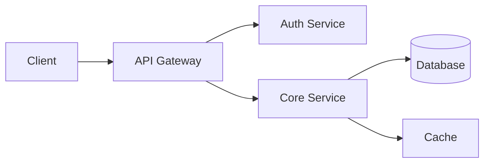

# README Patterns — Analyzed from Well-Regarded Projects

This reference catalogs recurring patterns from excellent open-source READMEs. Each pattern includes why it works, where it appears in the wild, and a template you can adapt.

---

## 1. Opening Patterns

The first 3 lines of a README determine whether someone keeps reading. Three dominant patterns emerge across successful projects.

### 1a. The Elevator Pitch — "X is a Y that does Z"

A single sentence that names the thing, categorizes it, and states its value.

**Why it works:** Readers instantly know what they're looking at. No mental effort required.

**Notable examples:**
- **axios**: "Promise based HTTP client for the browser and node.js"
- **fastify**: "Fast and low overhead web framework, for Node.js"
- **ripgrep**: "ripgrep recursively searches directories for a regex pattern while respecting your gitignore"
- **bat**: "A cat(1) clone with wings" (adds syntax highlighting and Git integration)
- **esbuild**: "An extremely fast bundler for the web"
- **jq**: "A lightweight and flexible command-line JSON processor"

**Template:**
```markdown
# project-name

**project-name** is a [category] that [primary value proposition].
```

**Anti-pattern to avoid:** "A modern, blazing-fast, next-generation..." — stacking adjectives without substance. One specific claim ("10x faster than X") beats three vague ones.

### 1b. The Problem-Solution Pattern

State the pain point, then position the project as the answer.

**Why it works:** Readers self-select. If they have the problem, they keep reading. This is especially effective for tools that replace an existing workflow.

**Notable examples:**
- **prettier**: Opens by describing the pain of arguing about code style, then positions itself as the tool that ends those arguments by enforcing consistent formatting automatically.
- **nvm**: Addresses the problem of managing multiple Node.js versions on one machine.
- **tldr**: Positions against the problem that man pages are too verbose for quick lookups.

**Template:**
```markdown
# project-name

Working with [domain] often means [pain point]. **project-name** fixes this by [mechanism].

<!-- or the shorter form: -->

# project-name

> [Pain point] is exhausting. **project-name** [solves it how].
```

**When to use this over the elevator pitch:** When your project replaces an existing tool or workflow. The reader needs to understand what's wrong with the status quo before your solution makes sense.

### 1c. The "Show, Don't Tell" Pattern

Lead with a screenshot, GIF, terminal recording, or code snippet before any prose.

**Why it works:** A visual instantly communicates what the project does, often faster than words. Particularly effective for CLI tools, UI libraries, and anything with a visual output.

**Notable examples:**
- **bat**: Opens with a side-by-side screenshot showing bat's syntax-highlighted output vs plain `cat`
- **delta**: Shows a screenshot of its styled git diff output immediately
- **starship**: Leads with a GIF of the prompt in action across different contexts
- **rich** (Python): Shows a screenshot of Rich's formatted terminal output right at the top
- **htop**: Screenshot of the running interface before any text
- **lazygit**: Animated GIF demo in the first scroll of the README

**Template:**
```markdown
# project-name

Short one-liner description.

<p align="center">
  
</p>
```

**When to use:** CLI tools, TUI applications, UI component libraries, anything where appearance is a selling point. If you can *show* what makes your project great, do it before you *tell*.

**Practical tip:** GIFs over screenshots when the interaction flow matters. Keep GIFs under 15 seconds and 5MB. Use tools like `vhs`, `asciinema`, or screen recording + gif conversion.

---

## 2. Documentation Depth Tiers

Not every project needs the same README. The right depth depends on the project's scope and audience.

### Tier 1: Small Utility / Library

**Profile:** A focused package that does one thing. Think: a string manipulation library, a single-purpose CLI tool, a small helper module.

**Sections (in order):**
1. Title + one-liner
2. Install
3. Usage (1-2 code examples)
4. API (if it's a library, brief)
5. License

**Total length:** 50-150 lines.

**Real-world models:** `is-odd`, `chalk`, `ms`, `mime-types`, `uuid`

**Template:**
```markdown
# package-name

One-line description of what it does.

## Install

```sh
npm install package-name
```

## Usage

```js
const package = require('package-name');

package.doThing('input');
// => 'expected output'
```

## API

### `doThing(input, [options])`

- `input` (string) — what it takes
- `options.flag` (boolean, default: false) — what it changes

Returns: `string`

## License

MIT
```

**Key insight:** For Tier 1 projects, completeness means *brevity*. Adding a Contributing Guide, Code of Conduct, Architecture section, or roadmap to a 200-line utility is noise.

### Tier 2: Medium Framework / Tool

**Profile:** A project with configuration options, multiple use cases, and an active community. Think: a web framework, a build tool, a testing library.

**Sections (in order):**
1. Title + description + badges
2. Key features (bullet list)
3. Quick-start (zero to working in 3-5 steps)
4. Usage examples (progressive: simple to advanced)
5. Configuration reference (or link to docs)
6. Benchmarks (if performance is a claim)
7. Contributing
8. License

**Total length:** 200-500 lines.

**Real-world models:** `fastify`, `zod`, `vitest`, `hono`, `poetry`

**Template:**
```markdown
# project-name

[](link) [](link) [](link)

Short description. One to two sentences.

## Features

- **Feature A** — what it does and why it matters
- **Feature B** — what it does and why it matters
- **Feature C** — what it does and why it matters

## Quick Start

```sh
npm install project-name
```

```js
// Minimal working example
const app = require('project-name');
app.doThing();
app.listen(3000);
```

## Examples

### Basic Usage

[code example with output]

### With Configuration

[code example with output]

### Advanced: [Specific Use Case]

[code example with output]

## Configuration

| Option | Type | Default | Description |
|--------|------|---------|-------------|
| `port` | number | 3000 | Server port |
| `debug` | boolean | false | Enable debug logging |

## Benchmarks

[table or chart — only if performance is an explicit selling point]

## Contributing

See [CONTRIBUTING.md](./CONTRIBUTING.md) for guidelines.

## License

MIT — see [LICENSE](./LICENSE)
```

### Tier 3: Large Platform / Ecosystem

**Profile:** A project with multiple sub-packages, extensive documentation, a large contributor base, and diverse user types. Think: React, Kubernetes, TensorFlow, Hugging Face Transformers.

**Sections (in order):**
1. Title + logo + description + badges
2. Elevator pitch (2-3 sentences)
3. Key features / highlights
4. Quick-start for the most common use case
5. Documentation links table (organized by topic)
6. Installation across multiple environments
7. Architecture overview (diagram or brief prose)
8. Community links (Discord, forum, Twitter, etc.)
9. Ecosystem / related projects
10. Contributing (link to detailed guide)
11. Citation (for academic projects)
12. License

**Total length:** 300-800 lines, with heavy use of links to external docs.

**Real-world models:** `transformers`, `kubernetes`, `next.js`, `flutter`, `pytorch`

**Key insight:** The Tier 3 README is a *routing document*. Its job is not to teach — it's to help different audiences find their way to the right detailed docs. A new user, a contributor, and a maintainer all land on the same README but need different links.

**Template for documentation routing table:**
```markdown
## Documentation

| | |
|---|---|
| **Getting Started** | [Installation](link) · [Tutorial](link) · [First App](link) |
| **Guides** | [Configuration](link) · [Deployment](link) · [Migration](link) |
| **API Reference** | [Core API](link) · [Plugins](link) · [CLI](link) |
| **Community** | [Discord](link) · [Forum](link) · [Stack Overflow](link) |
```

---

## 3. Ecosystem Conventions

Each language ecosystem has unwritten (and sometimes written) expectations for README content. Violating these creates friction — readers expect certain patterns and will be confused by their absence.

### npm / Node.js Packages

**Expected elements:**
- Badges: npm version, CI status, downloads, bundle size
- Install command showing both npm and yarn (often pnpm too)
- CommonJS and ESM import examples when both are supported
- `require` / `import` shown at the top of code examples
- TypeScript types mentioned (built-in or `@types/`)
- Node.js version compatibility stated
- Browser support noted if applicable

**Conventional install block:**
```markdown
## Installation

```sh
npm install package-name
# or
yarn add package-name
# or
pnpm add package-name
```
```

**Ecosystem-specific expectations:** Node.js developers expect to see real output comments (`// => value`) in code examples, and they expect examples to be copy-pasteable into a REPL or file.

### Python Packages (PyPI)

**Expected elements:**
- Badges: PyPI version, Python version support, CI status
- Install via `pip install` (and conda if available)
- Python version compatibility explicitly stated
- Virtual environment recommendation for CLI tools
- Type hints mentioned if the library uses them
- Jupyter notebook examples for data-oriented libraries

**Conventional install block:**
```markdown
## Installation

```sh
pip install package-name
```

Requires Python 3.9+.
```

**Ecosystem-specific expectations:** Python developers expect to see `>>>` REPL-style examples or script-style examples with `print()` output. For data science libraries, showing a Jupyter-style example with output (including DataFrame renders) is standard.

### Rust Crates

**Expected elements:**
- Badges: crates.io version, docs.rs link, CI status
- `Cargo.toml` dependency snippet (not just a command)
- Minimum Supported Rust Version (MSRV) stated
- `use` statement shown in examples
- Link to docs.rs for API documentation
- Feature flags documented if they exist
- `unsafe` usage policy stated for low-level crates

**Conventional install block:**
```markdown
## Installation

Add to your `Cargo.toml`:

```toml
[dependencies]
crate-name = "0.5"
```
```

**Ecosystem-specific expectations:** Rust developers expect examples to compile. Showing `fn main()` wrappers in examples is common. Feature flags should be documented in a table. The docs.rs badge is essentially mandatory — it's the Rust ecosystem's standard API reference.

### Go Modules

**Expected elements:**
- Badges: Go Reference (pkg.go.dev), CI status, Go Report Card
- `go get` or `go install` command
- Minimum Go version stated
- Import path shown in examples
- Link to pkg.go.dev for API docs
- Concise examples matching Go's documentation style

**Conventional install block:**
```markdown
## Installation

```sh
go get github.com/user/repo
```

Requires Go 1.21+.
```

**Ecosystem-specific expectations:** Go culture values minimalism in documentation. READMEs tend to be shorter, with detailed API docs living on pkg.go.dev. Examples should include error handling (don't ignore returned errors in examples — Go developers will notice and lose trust).

### CLI Tools

**Expected elements:**
- Multiple installation methods (package managers, binary download, build from source)
- Screenshot or GIF of the tool in action
- Command-line usage synopsis (`tool [FLAGS] [OPTIONS] <args>`)
- Common usage examples with real output
- Comparison with alternatives (optional but common)
- Shell completion instructions
- Configuration file format if applicable

**Conventional install block (multi-method):**
```markdown
## Installation

### Homebrew (macOS/Linux)
```sh
brew install tool-name
```

### Cargo (cross-platform)
```sh
cargo install tool-name
```

### Pre-built binaries
Download from [Releases](link).

### From source
```sh
git clone https://github.com/user/tool-name
cd tool-name
make install
```
```

**Ecosystem-specific expectations:** CLI tools live and die by their usage examples. Show 3-5 common invocations with actual terminal output. `ripgrep`, `fd`, `bat`, and `jq` are gold-standard examples of CLI tool READMEs.

### Web Applications

**Expected elements:**
- Screenshot of the running application
- Tech stack listed (framework, database, etc.)
- Prerequisites (Node.js version, database, etc.)
- Environment setup (`.env.example` or similar)
- Development server commands
- Deployment instructions or link
- Demo link if available

**Key difference from libraries:** Web app READMEs serve *contributors and deployers*, not package consumers. The emphasis shifts from API usage to "how do I run this locally" and "how do I deploy this."

### Mobile Apps

**Expected elements:**
- App store badges/links
- Screenshots of key screens (usually in a horizontal strip)
- Platform support (iOS versions, Android API levels)
- Build prerequisites (Xcode version, Android Studio, etc.)
- Build and run instructions
- Architecture overview for contributors

### Data Science / ML Projects

**Expected elements:**
- Model performance table (accuracy, F1, etc. on standard benchmarks)
- Hardware requirements (GPU, RAM, disk)
- Dataset information and download instructions
- Training and inference commands
- Pre-trained model download links or Hugging Face Hub integration
- Citation in BibTeX format
- Paper link
- Example predictions with input/output shown
- Colab/notebook badges for try-it-now access

**Conventional performance table:**
```markdown
## Results

| Model | Dataset | Accuracy | F1 | Params |
|-------|---------|----------|-----|--------|
| Ours (base) | CIFAR-10 | 95.2 | 94.8 | 11M |
| Ours (large) | CIFAR-10 | 97.1 | 96.9 | 44M |
| Previous SOTA | CIFAR-10 | 94.5 | 94.0 | 23M |
```

**Conventional citation block:**
```markdown
## Citation

If you use this work, please cite:

```bibtex
@article{author2025project,
  title={Project Title},
  author={Author, A. and Author, B.},
  journal={arXiv preprint arXiv:2025.12345},
  year={2025}
}
```
```

---

## 4. Visual Communication

### Screenshots and GIFs

**When to use screenshots:**
- The project has a visual interface (UI, TUI, formatted terminal output)
- A single frame captures the value (dashboards, themes, formatters)
- File size matters (screenshots are lighter than GIFs)

**When to use GIFs:**
- The interaction flow is the selling point (autocomplete, live reload, animations)
- Before-and-after comparisons in action
- The tool has a multi-step workflow

**Best practices:**
- Keep GIFs under 15 seconds and 5MB
- Use a consistent terminal theme (dark backgrounds read better on GitHub)
- Add alt text for accessibility
- Place the hero image/GIF within the first screenful
- Use `<p align="center">` for centered presentation on GitHub

**Tools for creating terminal GIFs/recordings:**
- `vhs` — Write a tape file, render to GIF. Reproducible and version-controllable.
- `asciinema` + `svg-term-cli` — Record terminal, render to SVG (sharper than GIF).
- `terminalizer` — Record and render terminal sessions to GIF.
- Screen recording + `ffmpeg` or Gifski for UI applications.

**Example placement:**
```markdown
# tool-name

A fast [thing] for [purpose].


```

### Architecture Diagrams

**When to use:** Tier 3 projects, or any project where the component relationships aren't obvious from the code structure. Especially useful for distributed systems, plugin architectures, and data pipelines.

**Best practices:**
- Use Mermaid diagrams (rendered natively by GitHub) for maintainability
- Keep diagrams simple — 5-10 boxes maximum
- Label relationships, not just components
- Store diagram source in the repo (not just an image) so contributors can update it

**Mermaid example (renders on GitHub):**
````markdown

````

### Badges That Inform vs Badge Spam

**Badges that earn their place:**
- **CI status** — Is this project healthy? (essential)
- **Version/release** — What's the latest? (essential for packages)
- **License** — Can I use this? (useful at a glance)
- **Documentation** — Is there API documentation? (useful for libraries)
- **Code coverage** — only if coverage is genuinely high (>80%)
- **Downloads** — social proof, useful for established projects

**Badges that are usually noise:**
- "PRs Welcome" — this is assumed for open-source projects
- Multiple redundant CI badges (one is enough)
- "Made with Love" or similar decorative badges
- Language/framework badges (the repo metadata already shows this)
- Code style badges (no one cares which formatter you use)
- Badges for every minor service integration

**Badge placement:** One line, 3-5 badges maximum, immediately after the title and before the description. Group by importance.

```markdown
# project-name

[](ci-link) [](npm-link) [](license-link)

Description here.
```

---

## 5. Code Example Patterns

### Pattern A: Minimal but Complete

The example should work if copy-pasted. No missing imports, no undefined variables, no "..." elisions in critical paths.

**Bad — missing context:**
```js
// How to use the cache
cache.set('key', value, { ttl: 60 });
const result = cache.get('key');
```

**Good — complete and runnable:**
```js
const { createCache } = require('project-name');

const cache = createCache();
cache.set('key', 'hello', { ttl: 60 });

const result = cache.get('key');
console.log(result);
// => 'hello'
```

### Pattern B: Copy-Pasteable

Ensure examples can be dropped into a real file or terminal without modification. This means:
- Include import/require statements
- Use real values, not `<placeholder>` syntax (except for secrets/tokens)
- Show the output as a comment or in a separate block
- Avoid variables defined "elsewhere"

**Exception:** API tokens and URLs may use placeholder syntax: `YOUR_API_KEY`, `https://api.example.com`

### Pattern C: Progressive Disclosure

Start with the simplest possible example, then layer in complexity. Each example builds on the previous one or shows a distinct, more advanced use case.

**Structure:**
```markdown
## Usage

### Basic

[3-5 lines, the simplest possible invocation]

### With Options

[builds on basic, adds configuration]

### Advanced: [Specific Use Case]

[real-world scenario, may be longer]
```

**Real-world example of this pattern (inspired by zod):**
```markdown
## Usage

### Basic Validation

```ts
import { z } from 'zod';

const schema = z.string().email();
schema.parse('hello@example.com'); // => 'hello@example.com'
schema.parse('not-an-email');      // throws ZodError
```

### Object Schemas

```ts
const User = z.object({
  name: z.string(),
  age: z.number().min(0),
  email: z.string().email(),
});

type User = z.infer<typeof User>;
// => { name: string; age: number; email: string }
```

### Nested and Composed Schemas

```ts
const Address = z.object({
  street: z.string(),
  city: z.string(),
  zip: z.string().regex(/^\d{5}$/),
});

const UserWithAddress = User.extend({
  addresses: z.array(Address),
});
```
```

### Pattern D: Show Real Output

Don't just show input code — show what happens when it runs. This builds trust and helps readers verify their setup.

**For libraries — inline comments:**
```js
slugify('Hello World!');
// => 'hello-world'
```

**For CLI tools — terminal blocks:**
```markdown
```console
$ tool-name --search "pattern" ./src
src/main.rs:42: let pattern = compile("pattern");
src/lib.rs:15: /// Matches a pattern against input

2 matches found in 0.003s
```
```

**For APIs — request and response:**
```markdown
```sh
curl -X POST https://api.example.com/users \
  -H "Content-Type: application/json" \
  -d '{"name": "Ada", "email": "ada@example.com"}'
```

Response:
```json
{
  "id": "usr_123",
  "name": "Ada",
  "email": "ada@example.com",
  "created_at": "2025-01-15T10:30:00Z"
}
```
```

**For data science — show the numbers:**
```python
model = load_model('base')
predictions = model.predict(test_data)

print(f"Accuracy: {accuracy_score(y_test, predictions):.3f}")
# => Accuracy: 0.952
```

### Pattern E: Language-Idiomatic Examples

Write examples in the style native to the ecosystem:

| Ecosystem | Style |
|-----------|-------|
| Python | `>>>` REPL or script with `print()`. Show DataFrame output for pandas-like libs. |
| JavaScript | `const`/`import`, `// => output` comments, async/await for modern code |
| Rust | Include `fn main()`, handle `Result`, show `cargo run` output |
| Go | Include `package main`, handle errors, show `go run` output |
| Shell/CLI | Use `$` prompt prefix, show actual command output below |
| TypeScript | Show type annotations, include type inference results |

---

## Appendix: Pattern Quick Reference

| Pattern | Best For | Key Element |
|---------|----------|-------------|
| Elevator pitch | Libraries, tools | "X is a Y that does Z" |
| Problem-solution | Replacement tools | Pain point then fix |
| Show don't tell | CLI, UI, visual tools | Screenshot/GIF first |
| Tier 1 depth | Small utilities | 5 sections, under 150 lines |
| Tier 2 depth | Frameworks, tools | Quick-start + examples + config |
| Tier 3 depth | Platforms, ecosystems | Routing document to detailed docs |
| Progressive disclosure | Any code examples | Simple then advanced |
| Real output shown | All projects | Comments or terminal blocks |

## Source Projects Referenced

These projects are referenced throughout this document as models of specific patterns:

- **axios** (npm) — clean elevator pitch, progressive examples
- **fastify** (npm) — benchmarks, feature bullets, quick-start
- **bat** (Rust/CLI) — screenshot-first, multi-method install
- **ripgrep** (Rust/CLI) — functional description, usage examples with output
- **zod** (TypeScript) — progressive disclosure in examples
- **rich** (Python) — visual-first, feature showcase screenshots
- **transformers** (Python/ML) — Tier 3 routing document, citation, model hub
- **prettier** (npm) — problem-solution opening
- **starship** (Rust/CLI) — GIF demo, cross-platform install matrix
- **delta** (Rust/CLI) — visual-first, comparison with alternatives
- **lazygit** (Go/TUI) — animated GIF demo, keyboard shortcuts
- **htop** (C/TUI) — screenshot of running interface
- **esbuild** (Go/npm) — performance claims backed by benchmarks
- **nvm** (Shell) — problem-solution for version management
- **tldr** (multi) — problem-solution for documentation
